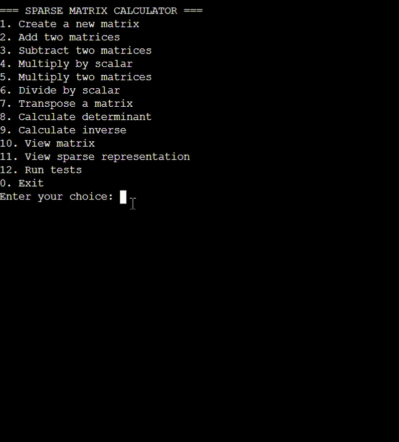

# 🎯 Sparse Matrix Calculator

> Save memory, calculate faster! A smart C++ implementation that only stores non-zero elements in matrices. 

## 📝 How it saves memory?
-  A 1000x1000 matrix with only 10 non-zero elements:
- Regular matrix: Stores 1,000,000 elements
- Sparse matrix: Stores only 10 elements plus their positions
- Memory savings: Approximately 99.999% less memory used!👀👀

## 🎬 Quick Demo



<details>
<summary>🎥 Watch Full Demo Video</summary>

<video width="800" controls>
  <source src=".github/assets/demo.mp4" type="video/mp4">
  Your browser does not support the video tag.
</video>

</details>

## ✨ What's Cool About This?

- 💾 **Super Memory Efficient**: Only stores numbers that matter (non-zero elements)
- 🚀 **Fast Operations**: Works only with non-zero elements, skipping all the zeros
- 🧮 **Smart Math Operations**:
  - ➕ Addition & Subtraction
  - ✖️ Multiplication (both scalar and matrix)
  - ➗ Division by scalar
  - 🔄 Matrix Transpose
  - 🎲 Determinant (1x1, 2x2, 3x3 matrices)
  - 🔄 Matrix Inverse

## 🛠️ Quick Start

### Prerequisites
- A C++ compiler (g++ is your friend!)
- C++11 or later

### Let's Get Started!
1. **Compile it:**
   ```bash
   g++ matrice.cpp -o matrix_calculator
   ```

2. **Run it:**
   ```bash
   ./matrix_calculator
   ```

3. **Play with it:**
   ```cpp
   // Here's a quick example
   SparseMatrix m1(3, 3);
   m1.insert(0, 0, 1.0);  // Add 1.0 at position (0,0)
   m1.insert(0, 2, 2.0);  // Add 2.0 at position (0,2)
   m1.display();          // See what you made!
   ```

## 🎮 Menu Options

Choose your operation:
1. 📝 Create a new matrix
2. ➕ Add matrices
3. ➖ Subtract matrices
4. ✖️ Multiply by number
5. 🔢 Multiply matrices
6. ➗ Divide by number
7. 🔄 Transpose
8. 🎲 Calculate determinant
9. 🔄 Calculate inverse
10. 👀 View matrix
11. 🔍 View sparse form
12. 🧪 Run tests

## 🧠 How It Works

### The Smart Part 🌟
Instead of storing a bunch of zeros, we use a clever linked list system:
```
Regular Matrix:    Our Storage:
1 0 2             Row 0 → (col:0, val:1) → (col:2, val:2)
0 0 0             Row 2 → (col:1, val:3)
0 3 0
```

### Space Magic ✨
- Traditional way: Stores ALL elements (even zeros)
- Our way: Stores only non-zero elements
- Result: Massive memory savings! 🎉

## 🚀 Performance

Operation | Speed
----------|--------
Insert    | Super Fast ⚡
Add/Sub   | Quick 🏃
Multiply  | Smart & Efficient 🧠
Transpose | Lightning Fast ⚡

## 🤝 Want to Help?

Got ideas? Want to make it even better? Here's how:
1. 🍴 Fork it
2. 🌱 Create your feature branch
3. 💪 Make your changes
4. 🎉 Open a pull request

## 🔮 Future Plans

- 📈 Handle bigger matrices
- 🧮 More math operations
- ⚡ Even faster calculations
- 💾 Save/load from files
- 🚀 Parallel processing

## 📜 License

This project is open source under the MIT License - do cool stuff with it! 🎉

## 👨‍💻 Author

Made with ❤️ by Zanjeel T. Sahi

## 🙏 Thanks To

- The amazing world of sparse matrices
- Coffee ☕
- Late night coding sessions 🌙 